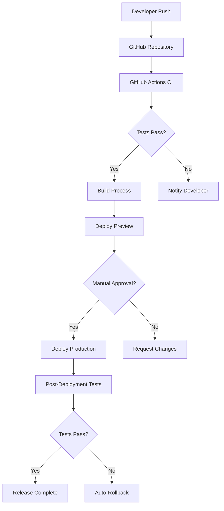

# Serverless Deployment Architecture

## Overview

This document outlines the serverless deployment architecture for the AI Chatbot application. The architecture leverages modern cloud services to provide a scalable, cost-effective solution that automatically handles varying workloads without manual intervention.

## Deployment Technology Stack

The serverless architecture uses the following key technologies:

- **Vercel**: For hosting the Next.js frontend and serverless API routes
- **Supabase**: For managed PostgreSQL database and authentication services
- **Upstash**: For Redis, Qstash, and Workflow services
- **Cloudflare R2**: For object storage (media, attachments, etc.)
- **GitHub Actions**: For CI/CD pipeline management

## Architecture Components

### Frontend Deployment

The frontend application will be deployed using Vercel's edge network:

- **Automatic Preview Deployments**: For each pull request
- **Branch Deployments**: For staging environments
- **Production Deployment**: From the main branch
- **Edge Function Rendering**: For improved global performance
- **Static Asset CDN**: For optimized delivery of static assets

### API Deployment

The application API will be deployed as serverless functions:

- **Next.js API Routes**: For core application functionality
- **Edge API Routes**: For low-latency, globally distributed endpoints
- **Middleware**: For authentication, rate limiting, and request validation
- **Scheduled Functions**: For recurring background tasks

### Database Layer

Supabase provides a managed PostgreSQL service that integrates well with our serverless architecture:

- **Connection Pooling**: For efficient handling of serverless connections
- **Automatic Scaling**: For handling varying database loads
- **Point-in-time Recovery**: For data protection
- **Read Replicas**: For enhanced read performance (on higher tier plans)

### Caching Strategy

Upstash Redis will be used as a distributed caching layer:

- **Session Storage**: For stateless API functions
- **API Response Caching**: For improved performance
- **Rate Limiting**: For API protection
- **Distributed Locking**: For coordinating concurrent operations
- **LLM Response Caching**: For improved cost efficiency

### Background Processing

Background jobs and async processing will use QStash and Upstash Workflow:

- **AI Agent Processing**: Long-running agents operate through workflows
- **Notification Delivery**: Asynchronous notification processing
- **Report Generation**: Scheduled and on-demand report creation
- **Data Synchronization**: Between different system components

## Deployment Workflow



### CI/CD Pipeline Stages

1. **Code Push**: Developer commits and pushes code to GitHub
2. **Automated Testing**: Unit, integration, and E2E tests run
3. **Build Process**: Application bundling and optimization
4. **Preview Deployment**: Deployment to staging/preview environment
5. **Manual Approval**: For production deployments (can be automated)
6. **Production Deployment**: Rolling deployment to production
7. **Post-Deployment Verification**: Automated checks to verify deployment
8. **Rollback Procedure**: Automatic rollback if checks fail

## Scaling Configuration

The serverless architecture will scale automatically based on demand:

### API Auto-Scaling

```typescript
// vercel.json scaling configuration
{
  "functions": {
    "api/chat/*.ts": {
      "memory": 1024,
      "maxDuration": 60
    },
    "api/agents/*.ts": {
      "memory": 2048,
      "maxDuration": 120
    }
  }
}
```

### Database Scaling

The database will be configured to scale connection pools based on demand:

```sql
-- Example Supabase connection pool configuration
ALTER SYSTEM SET max_connections = '300';
ALTER SYSTEM SET superuser_reserved_connections = '3';
```

### Rate Limiting Configuration

Rate limiting will be implemented using Upstash Redis:

```typescript
// apps/api/middleware.ts
import { Ratelimit } from '@upstash/ratelimit';
import { Redis } from '@upstash/redis';

const redis = new Redis({
  url: process.env.UPSTASH_REDIS_URL!,
  token: process.env.UPSTASH_REDIS_TOKEN!
});

// Create a new ratelimiter for different endpoints
const chatRatelimit = new Ratelimit({
  redis,
  limiter: Ratelimit.slidingWindow(20, '1m'), // 20 requests per minute
  analytics: true,
  prefix: 'ratelimit:chat'
});

const agentRatelimit = new Ratelimit({
  redis,
  limiter: Ratelimit.slidingWindow(5, '1m'), // 5 requests per minute
  analytics: true,
  prefix: 'ratelimit:agent'
});
```

## Multi-Region Deployment

The application will be deployed across multiple regions for improved global performance:

### Edge Configuration

```typescript
// next.config.js
module.exports = {
  experimental: {
    // Enable regions for edge functions
    regions: ['iad1', 'sfo1', 'hnd1', 'cdg1']
  }
};
```

### Global Database Strategy

For applications requiring multi-region database access:

1. **Read Replicas**: Utilizing Supabase read replicas in different regions
2. **Data Partitioning**: Using partitioned data for regional optimization
3. **Cache Invalidation**: Coordinated cache invalidation across regions

## Environment Configuration

The application will use the following environment structure:

- **Development**: Local development with emulators/Docker services
- **Preview**: Automatically deployed for feature branches
- **Staging**: Pre-production environment for testing
- **Production**: Live environment with strict access controls

### Environment Variables Management

Environment variables will be managed using Vercel's environment configuration:

```typescript
// packages/env/index.ts
import { createEnv } from '@t3-oss/env-nextjs';
import { z } from 'zod';

export const env = createEnv({
  server: {
    SUPABASE_URL: z.string().url(),
    SUPABASE_SERVICE_ROLE_KEY: z.string().min(1),
    UPSTASH_REDIS_URL: z.string().url(),
    UPSTASH_REDIS_TOKEN: z.string().min(1),
    OPENAI_API_KEY: z.string().min(1),
    STRIPE_SECRET_KEY: z.string().min(1),
    STRIPE_WEBHOOK_SECRET: z.string().min(1)
  },
  client: {
    NEXT_PUBLIC_SUPABASE_URL: z.string().url(),
    NEXT_PUBLIC_SUPABASE_ANON_KEY: z.string().min(1)
  },
  runtimeEnv: {
    SUPABASE_URL: process.env.SUPABASE_URL,
    SUPABASE_SERVICE_ROLE_KEY: process.env.SUPABASE_SERVICE_ROLE_KEY,
    UPSTASH_REDIS_URL: process.env.UPSTASH_REDIS_URL,
    UPSTASH_REDIS_TOKEN: process.env.UPSTASH_REDIS_TOKEN,
    OPENAI_API_KEY: process.env.OPENAI_API_KEY,
    STRIPE_SECRET_KEY: process.env.STRIPE_SECRET_KEY,
    STRIPE_WEBHOOK_SECRET: process.env.STRIPE_WEBHOOK_SECRET,
    NEXT_PUBLIC_SUPABASE_URL: process.env.NEXT_PUBLIC_SUPABASE_URL,
    NEXT_PUBLIC_SUPABASE_ANON_KEY: process.env.NEXT_PUBLIC_SUPABASE_ANON_KEY
  }
});
```

## Monitoring and Observability

The serverless deployment will include comprehensive monitoring:

### Logging Configuration

```typescript
// packages/logger/index.ts
import { Logger } from '@vercel/edge-logger';

export const logger = new Logger({
  projectId: process.env.VERCEL_PROJECT_ID,
  token: process.env.VERCEL_LOG_API_TOKEN,
  // Data filtering for compliance
  filter: (data) => {
    if (data.message?.includes('token') || data.message?.includes('password')) {
      return '[REDACTED]';
    }
    return data.message;
  }
});
```

### Custom Error Handling

```typescript
// apps/api/utils/error-handler.ts
import { logger } from '@/packages/logger';

export function handleApiError(error: unknown, context: string) {
  const errorId = generateErrorId();

  logger.error({
    message: `API Error in ${context}: ${error instanceof Error ? error.message : String(error)}`,
    errorId,
    stack: error instanceof Error ? error.stack : undefined,
    context
  });

  return {
    error: 'An unexpected error occurred',
    errorId,
    message:
      process.env.NODE_ENV === 'development'
        ? error instanceof Error
          ? error.message
          : String(error)
        : 'Please try again later'
  };
}
```

### Health Checks

Health check endpoints will be implemented to monitor service availability:

```typescript
// apps/api/app/api/health/route.ts
import { NextResponse } from 'next/server';
import { db } from '@/packages/database';
import { redis } from '@/packages/redis';

export async function GET() {
  try {
    // Check database connection
    await db.execute('SELECT 1');

    // Check Redis connection
    await redis.ping();

    return NextResponse.json({
      status: 'ok',
      services: {
        database: 'healthy',
        redis: 'healthy'
      },
      timestamp: new Date().toISOString()
    });
  } catch (error) {
    return NextResponse.json(
      {
        status: 'error',
        error: error instanceof Error ? error.message : String(error),
        timestamp: new Date().toISOString()
      },
      { status: 500 }
    );
  }
}
```

## Disaster Recovery Strategy

The serverless architecture includes disaster recovery mechanisms:

1. **Database Backups**: Automated daily backups with Supabase
2. **Point-in-time Recovery**: For database restoration
3. **Deployment Snapshots**: Vercel deployment history for rollbacks
4. **Infrastructure as Code**: Automated infrastructure restoration
5. **Multi-region Redundancy**: For service availability during regional outages

## Security Configuration

### API Route Protection

```typescript
// apps/api/middleware.ts
import { NextResponse } from 'next/server';
import { createMiddlewareClient } from '@supabase/auth-helpers-nextjs';

export async function middleware(request) {
  const response = NextResponse.next();
  const supabase = createMiddlewareClient({ req: request, res: response });

  // Verify session
  const {
    data: { session }
  } = await supabase.auth.getSession();

  // Protected routes pattern
  const protectedRoutes = ['/api/agents', '/api/subscription'];

  const isProtectedRoute = protectedRoutes.some((route) =>
    request.nextUrl.pathname.startsWith(route)
  );

  if (isProtectedRoute && !session) {
    return NextResponse.json({ error: 'Unauthorized' }, { status: 401 });
  }

  return response;
}
```

### CSP Configuration

```typescript
// apps/website/middleware.ts
import { NextResponse } from 'next/server';

export function middleware(request) {
  const response = NextResponse.next();

  // Set Content-Security-Policy header
  response.headers.set(
    'Content-Security-Policy',
    `
      default-src 'self';
      script-src 'self' 'unsafe-inline' https://js.stripe.com;
      style-src 'self' 'unsafe-inline';
      img-src 'self' https://avatars.githubusercontent.com https://lh3.googleusercontent.com https://ui-avatars.com data:;
      connect-src 'self' https://*.supabase.co https://*.upstash.io https://api.openai.com;
      frame-src https://js.stripe.com;
    `
      .replace(/\s+/g, ' ')
      .trim()
  );

  return response;
}
```

## Cost Optimization Strategies

The serverless architecture implementation includes cost optimization measures:

1. **Tiered Function Sizing**: Different memory/CPU allocations based on function needs
2. **Caching Strategy**: Redis caching to reduce compute and API costs
3. **LLM Prompt Optimization**: Techniques to minimize token usage
4. **Scheduled Scaling**: Anticipating high-traffic periods
5. **Cold Start Mitigation**: Techniques to reduce cold starts in critical paths

### Example Cold Start Mitigation

```typescript
// packages/api/utils/warm-up.ts
/**
 * Function to keep important functions warm by periodically invoking them
 * This reduces cold starts for critical user-facing functions
 */
export async function setupWarmupSchedule() {
  // Set up a cron job to ping critical endpoints every 5 minutes
  const criticalEndpoints = ['/api/chat', '/api/agents/execute', '/api/auth/session'];

  // The actual implementation would use a proper cron service like Upstash QStash
  setInterval(
    async () => {
      for (const endpoint of criticalEndpoints) {
        try {
          // Trigger endpoint with minimal payload
          await fetch(`https://${process.env.VERCEL_URL}${endpoint}/warm`, {
            method: 'POST',
            headers: { 'X-Warmup-Request': 'true' }
          });
        } catch (error) {
          // Log but don't alert on warmup failures
          console.error(`Warmup failed for ${endpoint}:`, error);
        }
      }
    },
    5 * 60 * 1000
  ); // Every 5 minutes
}
```

## Deployment Commands

The following commands are used to deploy the application:

```bash
# Install dependencies
pnpm install

# Build packages and applications
pnpm build

# Run linting and type checking
pnpm lint
pnpm typecheck

# Deploy to Vercel preview environment
vercel

# Deploy to Vercel production environment
vercel --prod
```

## Monorepo Deployment Configuration

```typescript
// turbo.json
{
  "pipeline": {
    "build": {
      "dependsOn": ["^build"],
      "outputs": [".next/**", "dist/**"]
    },
    "lint": {
      "outputs": []
    },
    "dev": {
      "cache": false
    },
    "deploy": {
      "dependsOn": ["build", "lint", "test"],
      "outputs": []
    }
  }
}
```

## Conclusion

This serverless deployment architecture provides a scalable, cost-effective solution for the AI Chatbot application. By leveraging cloud services like Vercel, Supabase, and Upstash, the application can scale dynamically based on demand while minimizing operational overhead. The architecture is designed to be resilient, secure, and performant, providing a solid foundation for the application's growth.
